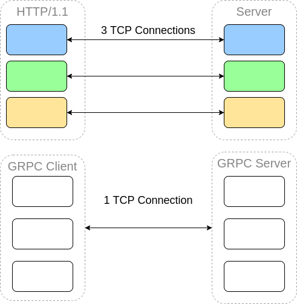

# 1. Simple GRPC server-client example
Grpc uses protobuffer as Interface Definition Language(IDL) and use as message interchage format

Grpc is very useful for distributed services, it easy to define a service, methods, request and response type.
Grpc server implements the same interface, receive client call and do some logic

It supports multiple languages and environments


More detail at: https://grpc.io/docs/what-is-grpc/introduction/

Grpc uses ***HTTP/2*** as protocol, it diff from HTTP/1.1, that make our applications more performance and robust. It reduce latency, make our data lightweight by binary framing.

**Header Compression** allow reduce request size

**Multiplexing** reduce the spawning TCP connections by reuse connections and send many requests with a single connection. In behind the scene, it create sub-channels that allow send and recieve many requests.




**CMD**

Download ***Buf*** tool to generate grpc client stubs: https://buf.build/docs/installation

Choose our directory contain proto files 
```
buf generate ./directory
```

Server run
```
go run ./cmd/server/server.go
```

Client run
```
go run ./cmd/client/client.go
```